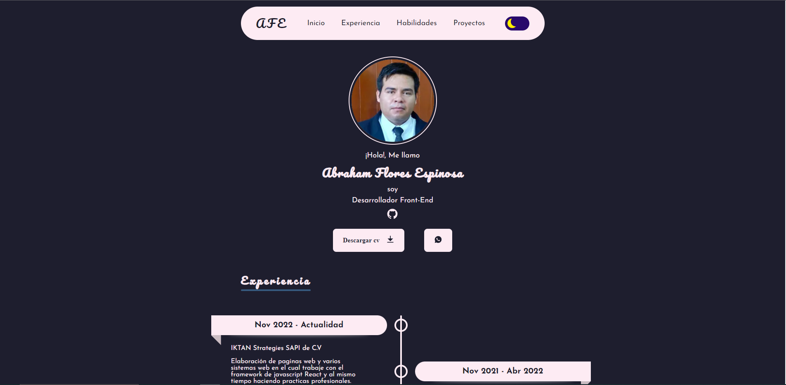

# 🧑‍🚀 Portfolio Personal

Portfolio personal sensillo construido en el framework de javascript Astro, puedes ver el demo [aqui](https://portfolio-abraham-flores-espinosa.vercel.app/){:target="\_blank"}.



## 💻 Ejecutalo

Si te gusto el template puedes hacer un Fork o clonarlo directamente.

1. Clona este repositorio

```
git clone https://github.com/AFE95XD/Portfolio.git
```

2. Instala las dependencias

```bash
npm install
```

3. Ejecuta el servidor de desarrollo

```bash
npm run dev
```

## 🧞 Comandos

Los comandos que puedes ocupar en una terminal:

| Comando         | Acion                                                       |
| :-------------- | :---------------------------------------------------------- |
| `npm install`   | Instala las dependencias                                    |
| `npm run dev`   | Inicia el servidor de desarrollo local en `localhost:4321`  |
| `npm run build` | Contruye el proyecto en `./dist/` para subirlo a produccion |
